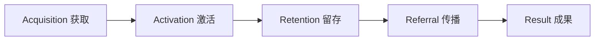

# 产品评估指标框架 (Metrics Framework)

## "星火相传" —— 两弹一星精神宣传平台

---

## 目录

- [1. 指标框架概述](#1-指标框架概述)
- [2. 北极星指标定义](#2-北极星指标定义)
- [3. AARRR 指标体系详述](#3-aarrr-指标体系详述)
- [4. 功能级评估指标](#4-功能级评估指标)
- [5. 指标监测计划](#5-指标监测计划)

---

## 1. 指标框架概述

本项目采用 **AARRR 海盗指标模型**（获取 → 激活 → 留存 → 传播 → 收入）作为核心指标体系，结合三下乡社会实践场景进行适配。由于项目为公益性质，将"收入"替换为"**成果**"（实践成果转化）。



---

## 2. 北极星指标定义

### 北极星指标：**周活跃答题用户数 (WAQU)**

| 维度 | 定义 |
|------|------|
| **指标名称** | 周活跃答题用户数 (Weekly Active Quiz Users) |
| **计算公式** | 统计周期内至少完成 1 轮答题（5 题）的独立用户数 |
| **目标值** | ≥ 200 WAQU（三下乡活动期间） |
| **选择依据** | ① 答题是产品核心互动功能，代表"有效学习"而非"路过浏览" ② 相比 PV/UV，更能反映宣讲质量 ③ 与团队考核目标（传播人数）直接挂钩 |

### 辅助指标：**净推荐值 (NPS)**

通过答题后弹窗询问："你愿意把这个推荐给朋友吗？"（1-5 分），用于评估用户满意度。

---

## 3. AARRR 指标体系详述

### 3.1 Acquisition（获取）—— 用户从哪来

| 指标 | 定义 | 目标 | 监测方式 |
|------|------|------|----------|
| **小程序累计 UV** | 微信小程序独立访客数 | ≥ 500 | 微信小程序后台 |
| **H5 累计 UV** | H5 网页独立访客数 | ≥ 300 | Umami / 百度统计 |
| **渠道来源分布** | 扫码/搜索/分享/朋友圈 占比 | 扫码 ≥ 60% | 微信后台 + 自定义参数 |
| **日均新增 UV** | 每日新增独立访客 | ≥ 50 | 微信后台 + H5 统计 |

### 3.2 Activation（激活）—— 用户来了用了吗

| 指标 | 定义 | 目标 | 监测方式 |
|------|------|------|----------|
| **首屏停留时长** | 用户在首页的停留时间 | ≥ 10 秒 | 埋点 |
| **首页点击率** | 点击功能入口的用户 / 首页 UV | ≥ 60% | 埋点 |
| **历史回顾浏览率** | 进入历史回顾页的用户 / 首页 UV | ≥ 40% | 埋点 |
| **人物志浏览率** | 进入人物志页的用户 / 首页 UV | ≥ 35% | 埋点 |
| **答题参与率** | 开始答题的用户 / 首页 UV | ≥ 40% | 埋点 |
| **精神卡片展开率** | 点击展开精神卡片的用户 / 首页 UV | ≥ 30% | 埋点 |

### 3.3 Retention（留存）—— 用户会回来吗

| 指标 | 定义 | 目标 | 监测方式 |
|------|------|------|----------|
| **次日留存率** | 次日回访用户 / 首日访问用户 | ≥ 15% | 微信后台 |
| **7 日留存率** | 7 日内回访用户 / 首日访问用户 | ≥ 5% | 微信后台 |
| **人均访问天数** | 活动期间用户平均访问天数 | ≥ 1.5 天 | 微信后台 |
| **重复答题率** | 答题 ≥ 2 轮的用户 / 答题用户 | ≥ 30% | 本地存储 + 埋点 |

### 3.4 Referral（传播）—— 用户会分享吗

| 指标 | 定义 | 目标 | 监测方式 |
|------|------|------|----------|
| **分享率** | 分享次数 / 答题完成次数 | ≥ 20% | 埋点 |
| **K 因子** | 平均每个用户带来的新用户数 | ≥ 0.3 | 分享来源追踪 |
| **海报生成率** | 生成海报次数 / 答题完成次数 | ≥ 15% | 埋点 |
| **分享渠道分布** | 朋友圈/好友/群聊 占比 | 朋友圈 ≥ 50% | 微信后台 |

### 3.5 Result（成果）—— 实践成果转化

| 指标 | 定义 | 目标 | 监测方式 |
|------|------|------|----------|
| **答题总轮数** | 活动期间累计答题轮数 | ≥ 500 轮 | 埋点 |
| **平均答题得分** | 所有用户答题平均分（满分 5） | ≥ 3.0 分 | 埋点 |
| **知识掌握率提升** | 活动后期平均分 vs 活动前期平均分 | 提升 ≥ 10% | 埋点对比 |
| **NPS 净推荐值** | 用户推荐意愿评分 | ≥ 4.0/5.0 | 答题后弹窗 |
| **宣讲场次覆盖** | 使用产品辅助的宣讲场次 | ≥ 5 场 | 团队手动记录 |

---

## 4. 功能级评估指标

### 4.1 首页模块

| 指标 | 目标 |
|------|------|
| 页面加载时间 | < 2 秒 |
| Banner 点击率 | ≥ 10% |
| 功能入口点击率 | 历史回顾 ≥ 35%，人物志 ≥ 30%，答题 ≥ 40% |

### 4.2 历史回顾模块

| 指标 | 目标 |
|------|------|
| 时间线完整浏览率（滚动到最后一个事件） | ≥ 30% |
| 事件详情页打开率 | ≥ 50% |
| 人均查看事件数 | ≥ 3 个 |

### 4.3 人物志模块

| 指标 | 目标 |
|------|------|
| 人物详情页打开率 | ≥ 50% |
| 人均查看人物数 | ≥ 2 位 |
| 详情页完整阅读率（滚动到底部） | ≥ 25% |

### 4.4 知识问答模块

| 指标 | 目标 |
|------|------|
| 答题开始率（首页 UV → 开始答题） | ≥ 40% |
| 答题完成率（完成 5 题 / 开始答题） | ≥ 80% |
| 平均答题用时（5 题） | 60-90 秒 |
| 重玩率（完成后再来一轮） | ≥ 30% |

### 4.5 分享模块

| 指标 | 目标 |
|------|------|
| 海报生成成功率 | ≥ 95% |
| 海报保存率（保存 / 生成） | ≥ 70% |

---

## 5. 指标监测计划

### 5.1 数据采集方案

| 平台 | 工具 | 采集内容 |
|------|------|----------|
| 微信小程序 | 微信小程序后台 + 自定义埋点 | UV、PV、留存、分享、来源 |
| H5 网页 | Umami Analytics（自部署或免费版） | UV、PV、来源、页面停留 |
| 应用内埋点 | 自定义事件（Taro 统一埋点） | 按钮点击、答题行为、海报生成 |

### 5.2 埋点事件清单

```typescript
// 页面浏览
trackPageView('home')           // 首页
trackPageView('timeline')       // 历史回顾
trackPageView('event_detail')   // 事件详情
trackPageView('people_list')    // 人物列表
trackPageView('people_detail')  // 人物详情
trackPageView('quiz_start')     // 答题入口
trackPageView('quiz_result')    // 答题结果
trackPageView('ranking')        // 排行榜
trackPageView('about')          // 关于页

// 用户行为
trackEvent('spirit_card_click', { index })       // 精神卡片展开
trackEvent('timeline_node_click', { eventId })   // 时间线节点点击
trackEvent('people_card_click', { personId })    // 人物卡片点击
trackEvent('quiz_answer', { questionId, correct, time })  // 答题
trackEvent('quiz_complete', { score, totalTime })         // 答题完成
trackEvent('quiz_retry')                          // 再来一轮
trackEvent('share_poster_generate')               // 海报生成
trackEvent('share_poster_save', { platform })     // 海报保存
trackEvent('share_link', { channel })             // 链接分享
```

### 5.3 监测节奏

| 频率 | 事项 | 负责人 |
|------|------|--------|
| **每日** | 查看小程序后台 UV/PV、H5 统计数据 | 1 人 |
| **每场宣讲后** | 记录宣讲场次、参与人数、答题数据 | 宣讲队员 |
| **每周** | 汇总周报，分析趋势，调整策略 | 全员 |
| **活动结束后** | 输出完整数据报告，支撑实践报告 | 1 人 |

### 5.4 数据看板（建议）

活动期间建议使用腾讯文档/Excel 搭建简易看板：

| 日期 | 小程序 UV | H5 UV | 答题人数 | 答题轮数 | 平均分 | 分享次数 | 备注 |
|------|-----------|--------|----------|----------|--------|----------|------|
| 7/29 | - | - | - | - | - | - | |
| ... | ... | ... | ... | ... | ... | ... | |

---

> **文档结束** — 版本 v1.0 | 2026-07-28