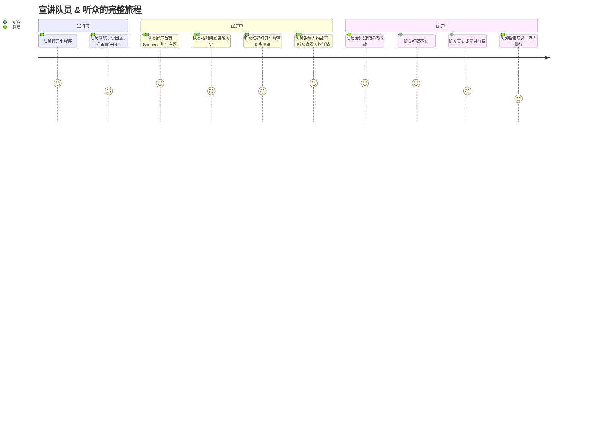
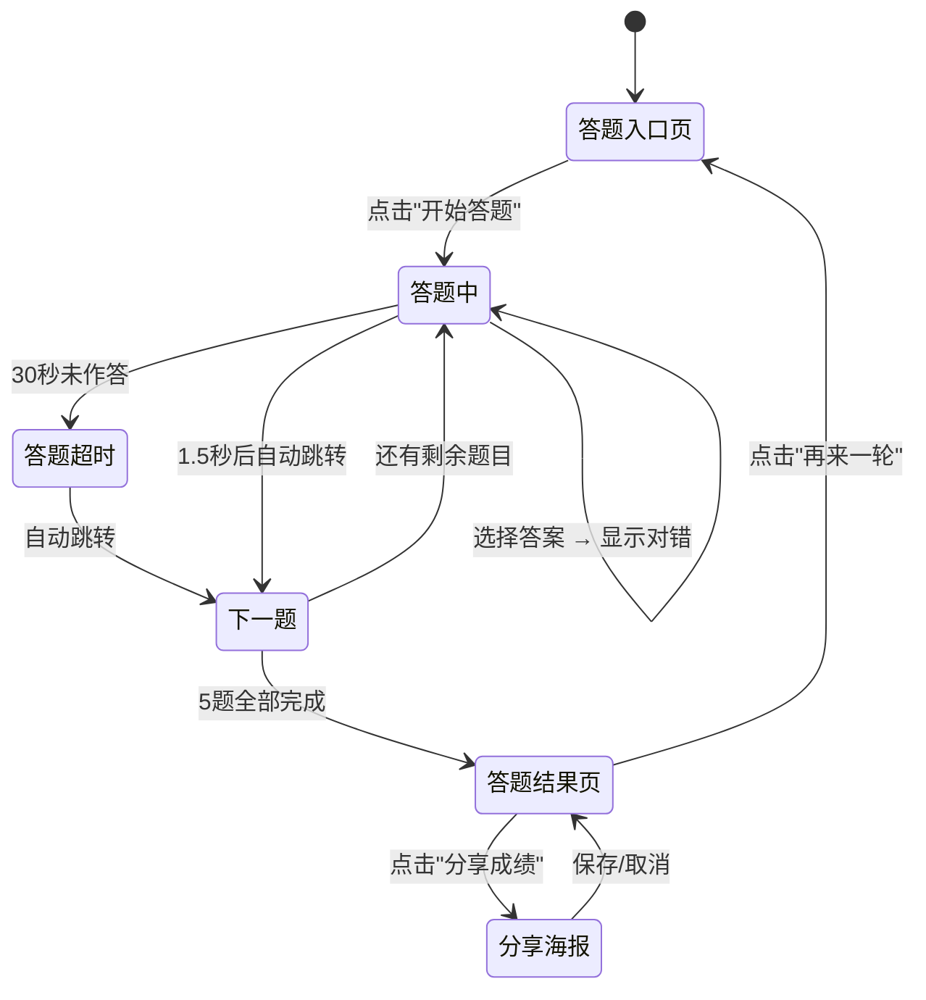

# 产品需求文档 (PRD)

## "星火相传" —— 两弹一星精神宣传平台

---

## 目录

- [1. 文档信息](#1-文档信息)
- [2. 产品概述](#2-产品概述)
- [3. 用户研究](#3-用户研究)
- [4. 市场与竞品分析](#4-市场与竞品分析)
- [5. 产品功能需求](#5-产品功能需求)
- [6. 用户流程与交互设计指导](#6-用户流程与交互设计指导)
- [7. 非功能需求](#7-非功能需求)
- [8. 技术架构考量](#8-技术架构考量)
- [9. 验收标准汇总](#9-验收标准汇总)
- [10. 产品成功指标](#10-产品成功指标)

---

## 1. 文档信息

### 1.1 版本历史

| 版本 | 日期 | 作者 | 变更说明 |
|------|------|------|----------|
| v1.0 | 2026-07-28 | 产品团队 | 初版 PRD，定义 MVP 范围 |

### 1.2 文档目的

本文档定义"星火相传"两弹一星精神宣传平台的产品需求，明确 MVP 版本的功能范围、交互要求、验收标准，作为设计、开发、测试团队的工作依据。

### 1.3 相关文档引用

| 文档 | 路径 | 说明 |
|------|------|------|
| 产品路线图 | `docs/Roadmap.md` | 版本规划与迭代计划 |
| 用户故事地图 | `docs/User_Story_Map.md` | 用户故事分解与优先级 |
| 指标框架 | `docs/Metrics_Framework.md` | 产品成功指标定义 |

---

## 2. 产品概述

### 2.1 产品名称与定位

- **产品名称**：星火相传
- **Slogan**：铭记两弹一星，传承精神火种
- **产品定位**：面向大众的轻量级"两弹一星"精神宣传教育平台，以图文展示、互动问答为核心，适用于三下乡社会实践场景中的精神宣讲与传播。

### 2.2 产品愿景与使命

- **愿景**：让每一位中国人了解"两弹一星"的辉煌历史，让"热爱祖国、无私奉献、自力更生、艰苦奋斗、大力协同、勇于登攀"的精神在新时代延续。
- **使命**：通过数字化手段，为三下乡团队提供便捷、高效的精神宣传工具，降低红色文化传播门槛。

### 2.3 价值主张与独特卖点 (USP)

| 维度 | 描述 |
|------|------|
| **轻量化** | 无需下载 App，微信扫码即用，H5 链接一键分享 |
| **互动性** | 不只是单向阅读，知识问答闯关让用户在参与中学习 |
| **场景适配** | 专为三下乡宣讲场景设计，适配线下展览、课堂讲解、入户宣传等多种场景 |
| **快速上线** | 基于 Taro 跨端框架，2-3 周内完成双端 MVP 交付 |

### 2.4 目标平台列表

| 平台 | 优先级 | 说明 |
|------|--------|------|
| **微信小程序** | P0（必须） | 微信生态内传播，方便乡村群众扫码访问 |
| **H5 网页** | P0（必须） | 支持链接分享到 QQ、朋友圈、浏览器访问 |

> **技术策略**：采用 Taro 跨端框架，一套代码同时编译输出微信小程序和 H5，最大化开发效率。

### 2.5 产品核心假设

1. **内容假设**：用户对"两弹一星"历史有基础认知需求，图文+互动形式能有效提升学习兴趣。
2. **传播假设**：微信生态（小程序+朋友圈分享）是面向乡村群众最高效的传播渠道。
3. **场景假设**：三下乡团队在宣讲时需要一个"数字化辅助工具"来替代传统展板/传单。
4. **技术假设**：Taro 框架能实现双端 95% 以上代码复用，满足 2-3 周交付要求。

### 2.6 商业模式概述

本项目为公益性质的三下乡社会实践项目，**不涉及商业变现**。未来可考虑对接学校思政教育平台、红色旅游景区的导览需求。

---

## 3. 用户研究

### 3.1 目标用户画像

#### 3.1.1 用户画像 A：三下乡宣讲队员（核心用户）

| 维度 | 描述 |
|------|------|
| **人口统计** | 在校大学生，18-22 岁，男女均衡 |
| **行为习惯** | 熟练使用微信、短视频平台，习惯扫码获取信息 |
| **核心需求** | 需要一个专业、便捷的宣讲辅助工具，替代厚重的纸质资料 |
| **核心痛点** | ① 缺乏专业宣讲素材 ② 纸质传单传播效率低 ③ 宣讲效果难以量化 |
| **动机目标** | 高效完成宣讲任务，让受众真正理解两弹一星精神 |

#### 3.1.2 用户画像 B：乡村群众/普通受众

| 维度 | 描述 |
|------|------|
| **人口统计** | 乡村居民、中小学生为主，年龄跨度大（10-60 岁） |
| **行为习惯** | 微信使用率高，偏好短视频和图片，阅读长文耐心有限 |
| **核心需求** | 快速了解"两弹一星是什么""为什么重要" |
| **核心痛点** | ① 历史知识储备不足 ② 对专业术语理解困难 ③ 缺乏参与感 |
| **动机目标** | 获得知识增量，感受自豪感，可能转发分享 |

#### 3.1.3 用户画像 C：学校/团委审核老师

| 维度 | 描述 |
|------|------|
| **核心需求** | 查看项目成果、传播数据，评估社会实践效果 |
| **核心痛点** | 缺乏量化数据支撑实践报告 |

### 3.2 用户场景分析

#### 3.2.1 核心使用场景

**场景 1：线下宣讲会**
> 宣讲队员在村委会议室/学校教室进行宣讲，大屏幕展示 H5 网页，观众扫码进入小程序同步浏览，宣讲结束后发起知识问答挑战。

**场景 2：入户走访宣传**
> 队员入户走访，让村民扫码打开小程序，通过图文和语音播报了解两弹一星精神，完成简单问答后可领取小礼品。

**场景 3：线上自主传播**
> 用户通过朋友圈/微信群分享 H5 链接，好友点击即可浏览学习，形成二次传播。

**场景 4：实践成果展示**
> 项目结项时，团队向老师展示小程序访问量、答题数据、分享次数等数据看板。

#### 3.2.2 边缘使用场景

- 无网络环境下的离线展示（MVP 不做，v2.0 考虑）
- 老年人不熟悉智能手机操作（需队员辅助，产品设计需降低操作门槛）

### 3.3 用户调研洞察

基于三下乡社会实践的通用经验，得出以下关键洞察：

1. **"扫码即用"是最低门槛**：乡村群众对下载 App 抵触强，微信扫码打开小程序是最优路径。
2. **"有奖问答"能显著提升参与度**：小礼品激励下的答题参与率远高于被动阅读。
3. **图片比文字更有传播力**：历史老照片、人物肖像、对比图比纯文字更容易引发共鸣和转发。
4. **宣讲队员需要"脚本"**：产品应内置宣讲引导流程，帮助队员有条理地展开讲解。

---

## 4. 市场与竞品分析

### 4.1 市场规模与增长预测

- 红色文化数字化市场处于政策驱动增长期，每年暑期三下乡团队超百万支，涉及学生超千万人次。
- 思政教育数字化是教育部重点推进方向，市场需求持续增长。

### 4.2 行业趋势分析

| 趋势 | 对本项目的影响 |
|------|----------------|
| 微信小程序生态成熟 | 小程序是触达乡村用户的最优解 |
| 短视频/图文为主流内容形式 | 产品内容需以图文为主，避免大段文字 |
| 互动式学习兴起 | 知识问答闯关比单向阅读更有吸引力 |
| 跨端开发框架普及 | Taro 等技术可实现低成本双端覆盖 |

### 4.3 竞争格局分析

#### 4.3.1 直接竞品

| 竞品 | 优势 | 劣势 |
|------|------|------|
| 学习强国 App | 内容权威全面，功能强大 | 太重，不适合三下乡轻量场景 |
| 各地红色纪念馆小程序 | 内容专业，沉浸感强 | 单个场馆，覆盖面窄，缺互动问答 |

#### 4.3.2 间接竞品

- 微信公众号文章（图文推送）：制作简单但互动性差
- 传统纸质展板/传单：成本低但不环保、传播效率低

### 4.4 竞品功能对比矩阵

| 功能 | 学习强国 | 纪念馆小程序 | 公众号文章 | **星火相传 (本项目)** |
|------|----------|-------------|------------|----------------------|
| 历史图文展示 | ✅ | ✅ | ✅ | ✅ |
| 人物介绍 | ✅ | ✅ | 部分 | ✅ |
| 时间线 | ✅ | ❌ | ❌ | ✅ |
| 知识问答互动 | ✅ | ❌ | ❌ | ✅ |
| 答题排行榜 | ✅ | ❌ | ❌ | ✅ (MVP 简化版) |
| 分享传播 | ✅ | ✅ | ✅ | ✅ |
| 轻量/快速上手 | ❌ | ✅ | ✅ | ✅ |
| 双端覆盖 | ✅ | ❌ | ✅ | ✅ |
| 离线使用 | ✅ | ❌ | ❌ | ❌ (v2.0) |

### 4.5 市场差异化策略

**核心差异化**：轻量化 + 互动问答 + 三下乡场景深度适配

- 不追求大而全，专注"能用、好用、够用"
- 知识问答是核心互动抓手，区别于纯展示型产品
- 为宣讲场景设计引导流程，实现"人+产品"配合

---

## 5. 产品功能需求

### 5.1 功能架构与模块划分

```
星火相传 v1.0 (MVP)
├── 首页模块
│   ├── 主题 Banner
│   ├── 精神内涵展示（24 字精神）
│   └── 功能入口导航
├── 历史回顾模块
│   ├── 历史时间线
│   ├── 大事件详情页
│   └── 历史影像资料（图片）
├── 人物志模块
│   ├── 功勋人物列表
│   └── 人物详情页
├── 知识问答模块
│   ├── 答题闯关
│   ├── 答题结果页
│   └── 排行榜（简化版）
├── 分享模块
│   ├── 生成分享海报
│   └── 微信转发
└── 关于模块
    └── 团队介绍 & 项目说明   //小孩专栏、 讲解员专栏
```

### 5.2 核心功能详述

---

#### 5.2.1 首页模块

**功能描述（用户故事）**：
> 作为宣讲队员/普通用户，我想要打开小程序就能看到两弹一星的核心精神内涵，以便快速建立对"两弹一星"的整体认知。

**用户价值**：产品第一印象，3 秒内传达核心主题。

**功能逻辑与规则**：
1. 顶部展示主题 Banner 图（两弹一星相关历史图片/设计图），支持轮播 2-3 张
2. Banner 下方展示"两弹一星精神"24 字：**热爱祖国、无私奉献、自力更生、艰苦奋斗、大力协同、勇于登攀**
3. 24 字精神采用卡片式布局，每 4 个字一张卡片，点击可展开简短释义
4. 下方提供三个功能入口卡片：**历史回顾**、**功勋人物**、**知识问答**
5. 页面底部展示团队信息入口

**交互要求**：
- Banner 自动轮播，3 秒切换，支持手动滑动
- 精神卡片点击展开/收起动画
- 功能入口卡片点击跳转，带点击反馈动效

**数据需求**：
- Banner 图片 URL 列表（配置化）
- 精神内涵释义文本（配置化）

**技术依赖**：无

**验收标准**：
- [ ] 页面加载时间 < 2 秒
- [ ] Banner 自动轮播正常，手动滑动无卡顿
- [ ] 24 字精神卡片点击展开/收起动画流畅
- [ ] 三个功能入口均可正常跳转
- [ ] 微信小程序端和 H5 端表现一致

---

#### 5.2.2 历史回顾模块

**功能描述（用户故事）**：
> 作为普通用户，我想要按时间线浏览两弹一星的发展历程，以便系统性地了解这段历史。

**用户价值**：以时间线形式呈现历史，降低认知门槛，增强代入感。

**功能逻辑与规则**：
1. 页面顶部为标题"历史回顾"
2. 主体为纵向时间线，从 1950 年代至 1970 年代
3. 时间线节点共 8-12 个关键事件，每个节点包含：
   - 年份
   - 事件标题
   - 简短描述（50 字以内）
   - 缩略图
4. 点击节点进入**大事件详情页**：
   - 事件标题
   - 详细描述（200-300 字）
   - 1-3 张配图
   - 返回按钮

**交互要求**：
- 时间线采用滚动触发渐入动画（节点从左侧滑入）
- 图片支持点击放大预览
- 详情页支持手势右滑返回（小程序端）

**数据需求**：
- 时间线事件数据（JSON 数组，包含年份、标题、描述、图片 URL）
- 详情页富文本内容

**技术依赖**：无

**验收标准**：
- [ ] 时间线节点数量 ≥ 8 个
- [ ] 每个节点可点击进入详情页
- [ ] 详情页图片可放大预览
- [ ] 滚动动画流畅，60fps
- [ ] 双端表现一致

---

#### 5.2.3 人物志模块

**功能描述（用户故事）**：
> 作为普通用户，我想要了解为两弹一星做出贡献的功勋人物，以便感受他们的奉献精神和爱国情怀。

**用户价值**：人物故事是最有感染力的传播载体，能引发情感共鸣。

**功能逻辑与规则**：
1. 页面展示功勋人物列表，采用卡片式布局（2 列网格）
2. 每位人物卡片包含：头像、姓名、简短称号（如"中国原子弹之父"）
3. 初版 MVP 包含 6-8 位核心人物，如：
   - 钱学森、邓稼先、钱三强、郭永怀、王淦昌、程开甲、于敏、孙家栋
4. 点击卡片进入**人物详情页**：
   - 人物肖像（大图）
   - 生卒年份
   - 主要贡献（2-3 段，每段 100-150 字）
   - 名言金句（1-2 句）
   - 相关历史图片（1-2 张）

**交互要求**：
- 列表页支持下拉刷新
- 卡片点击有缩放反馈动效
- 详情页滚动阅读，底部有"下一位人物"引导

**数据需求**：
- 人物数据（JSON 数组，包含姓名、称号、头像 URL、生卒年份、贡献描述、名言、配图 URL）

**技术依赖**：无

**验收标准**：
- [ ] 人物列表 ≥ 6 位
- [ ] 每位人物均有详情页，内容完整
- [ ] 图片加载正常，无裂图
- [ ] 卡片布局在双端适配良好

---

#### 5.2.4 知识问答模块（核心互动功能）

**功能描述（用户故事）**：
> 作为宣讲队员，我想要在宣讲后发起知识问答挑战，以便检验听众的学习效果并增加互动趣味性。
> 作为普通用户，我想要通过答题测试自己对两弹一星知识的了解程度，以便获得成就感和分享动力。

**用户价值**：产品核心互动抓手，将被动学习转化为主动参与，提升传播效果。

**功能逻辑与规则**：
1. **答题入口**：首页"知识问答"入口 + 历史详情页/人物详情页底部引导
2. **题库**：MVP 版本包含 20-30 道选择题（单选），每题 4 个选项
3. **答题流程**：
   - 每轮随机抽取 5 道题
   - 每题限时 30 秒，超时视为答错
   - 选择后立即显示对错（绿色正确/红色错误 + 正确答案提示）
   - 答完 5 题后进入结果页
4. **结果页**：
   - 显示得分（答对 X/5 题）
   - 根据得分显示不同评语：
     - 5/5：**"两弹一星精神传承人"**
     - 3-4/5：**"再接再厉，继续学习！"**
     - 0-2/5：**"快去历史回顾补补课吧~"**
   - "再来一轮"按钮
   - "分享成绩"按钮（生成带分数的分享海报）
5. **排行榜**（简化版）：
   - 展示当前用户最高分和排名
   - 展示 Top 10 排行榜（仅显示微信昵称首字+**，保护隐私）
   - 数据存储在本地缓存，MVP 不做后端

**交互要求**：
- 答题时倒计时进度条动画
- 选择答案后 0.5 秒显示对错，1.5 秒后自动跳转下一题
- 结果页有分数展示动画（数字滚动）
- 分享海报自动生成，包含分数和产品二维码

**数据需求**：
- 题库数据（JSON 数组，包含题目、4 个选项、正确答案索引、知识解析）
- 排行榜数据（本地存储）

**技术依赖**：
- 微信分享海报需要 Canvas 绘制能力
- 排行榜需要本地存储（Taro 提供跨端 Storage API）

**验收标准**：
- [ ] 题库 ≥ 20 道题，覆盖历史、人物、精神内涵
- [ ] 每轮随机抽题不重复
- [ ] 30 秒倒计时正常，超时自动判错
- [ ] 答题结果页显示正确
- [ ] "再来一轮"重新随机抽题
- [ ] 分享海报生成正常
- [ ] 排行榜数据正确存储和展示

---

#### 5.2.5 分享模块

**功能描述（用户故事）**：
> 作为普通用户，我想要把答题成绩分享到朋友圈，以便向朋友展示并邀请他们也来学习。

**用户价值**：实现产品自传播，降低获客成本。

**功能逻辑与规则**：
1. 答题结果页提供"分享成绩"按钮
2. 点击后生成分享海报（Canvas 绘制）：
   - 海报包含：产品名称、用户得分、评语、精神 24 字（部分）、小程序码
3. 小程序端：保存图片到相册 → 引导用户转发
4. H5 端：长按保存图片 → 引导分享链接

**交互要求**：
- 海报生成过程显示 loading 动画
- 生成完成后展示预览，用户确认后再保存

**验收标准**：
- [ ] 海报生成成功，包含得分信息
- [ ] 小程序端可保存图片到相册
- [ ] H5 端可长按保存

---

#### 5.2.6 关于模块

**功能描述**：展示三下乡团队信息、项目背景、参考资料来源。

**功能逻辑与规则**：
1. 团队名称、学校、成员介绍
2. 项目背景说明
3. 内容参考来源声明（书籍、网站等）
4. 联系方式（可选）

**验收标准**：
- [ ] 团队信息完整展示
- [ ] 参考来源声明清晰

---

### 5.3 次要功能描述

| 功能 | 优先级 | 说明 |
|------|--------|------|
| 语音播报 | P2 | 人物详情页支持 TTS 朗读，方便老年用户 |
| 深色模式 | P2 | 适配系统深色模式 |
| 英语版本 | P3 | 面向国际友人传播 |

### 5.4 未来功能储备 (Backlog)

| 功能 | 版本规划 | 说明 |
|------|----------|------|
| 后端服务 + 云端排行榜 | v2.0 | 实现真实排行榜和用户系统 |
| 内容管理后台 | v2.0 | 方便非技术人员更新内容 |
| 视频播放模块 | v2.0 | 嵌入纪录片/采访视频 |
| 离线缓存 | v2.0 | 无网络环境下可浏览已缓存内容 |
| VR/AR 展馆 | v3.0 | 沉浸式体验核试验基地等场景 |

---

## 6. 用户流程与交互设计指导

### 6.1 核心用户旅程地图

**用户旅程：宣讲场景下的完整体验**



### 6.2 关键流程详述

**答题完整流程：**



### 6.3 对设计师 (UI/UX) 的界面原型参考说明

**设计风格关键词**：庄重、简洁、现代、红色主题

**色彩体系建议**：
- 主色调：**中国红** `#C41E3A`（传递红色文化主题）
- 辅助色：**金色** `#D4A843`（荣誉、辉煌感）
- 背景色：米白色 `#F5F0E8`（柔和，不刺眼）
- 文字色：深灰 `#333333`（可读性优先）

**关键页面设计要点**：

| 页面 | 设计要点 |
|------|----------|
| 首页 | Banner 要有冲击力，24 字精神要醒目，整体庄重大气 |
| 时间线 | 纵向线条+节点设计，图文并茂，留白充足 |
| 人物列表 | 卡片式，头像突出，称号文字有辨识度 |
| 人物详情 | 大图+文字排版，段落不宜过长，金句高亮突出 |
| 答题页 | 倒计时醒目，选项按钮大且易点击，对错反馈清晰 |
| 结果页 | 分数展示有仪式感，评语个性化，分享按钮突出 |

**字体建议**：
- 标题：使用粗体，字号 20-24px
- 正文：使用常规字重，字号 14-16px
- 小程序端注意适配不同屏幕尺寸

### 6.4 交互设计规范与原则建议

1. **极简操作**：核心流程不超过 3 步，减少用户认知负担
2. **即时反馈**：所有点击操作有视觉反馈（缩放、颜色变化）
3. **容错设计**：答题超时自动处理，防止用户困惑
4. **无障碍**：按钮最小点击区域 ≥ 44x44px（微信规范）
5. **加载体验**：图片使用骨架屏占位，避免页面跳动

---

## 7. 非功能需求

### 7.1 性能需求

| 指标 | 目标值 | 测量方法 |
|------|--------|----------|
| 首屏加载时间 | < 2 秒 | Lighthouse / 微信性能面板 |
| 页面切换响应 | < 300ms | 手动测试 |
| 图片加载 | 渐进式加载，不阻塞页面 | 使用懒加载 |
| 包体积（小程序） | < 2MB（主包） | 微信开发者工具 |
| 并发支持 | 50+ 用户同时访问（H5 静态托管） | 静态托管平台自动扩容 |

### 7.2 安全需求

| 需求 | 说明 |
|------|------|
| 内容防篡改 | 静态内容托管，源码版本管理，防止内容被恶意修改 |
| 隐私保护 | 排行榜仅展示昵称首字，不收集用户手机号等敏感信息 |
| HTTPS | H5 端强制 HTTPS 访问 |

> MVP 版本无后端，无用户登录，安全风险较低。

### 7.3 可用性与可访问性标准

- 核心功能入口在首屏可见，无需滚动
- 字体大小适配老年用户，建议最小正文字号 ≥ 14px
- 色彩对比度符合 WCAG AA 标准（正文对比度 ≥ 4.5:1）
- 关键按钮有明确的视觉层级

### 7.4 合规性要求

- 微信小程序需通过微信审核，内容需符合《微信小程序平台运营规范》
- 历史内容引用需注明来源，规避版权风险
- 人物肖像使用需注意形象正面、来源合规

### 7.5 数据统计与分析需求

| 埋点事件 | 说明 | 优先级 |
|----------|------|--------|
| 页面访问 PV | 各页面访问量 | P0 |
| 答题参与次数 | 答题总次数 | P0 |
| 答题完成率 | 完成答题 / 开始答题 | P0 |
| 分享次数 | 海报生成/分享次数 | P0 |
| 平均答题得分 | 用户平均得分 | P1 |
| 页面停留时长 | 各页面平均停留时间 | P1 |

> MVP 使用微信小程序自带的统计后台 + H5 端接入百度统计/Umami 等轻量方案。

---

## 8. 技术架构考量

### 8.1 技术栈建议

| 层级 | 技术选型 | 选型理由 |
|------|----------|----------|
| **跨端框架** | Taro 3.x | 一套代码同时编译微信小程序 + H5，React 语法 |
| **UI 框架** | Taro UI / NutUI | 跨端兼容的组件库，减少样式适配工作量 |
| **语言** | TypeScript | 类型安全，减少运行时错误，适合团队协作 |
| **状态管理** | React Hooks (useState/useReducer) | MVP 数据流简单，无需引入 Redux/MobX |
| **样式方案** | SCSS Modules | 样式隔离，支持变量和嵌套 |
| **静态托管** | H5 部署到 GitHub Pages / 腾讯云静态托管 | 免费、快速、支持 HTTPS |
| **数据存储** | Taro Storage API（本地） | 排行榜、用户答题记录本地存储 |

### 8.2 系统集成需求

MVP 阶段无外部系统集成。v2.0 考虑：
- 微信云开发（排行榜、用户数据）
- 内容管理 CMS（方便非技术人员更新内容）

### 8.3 技术依赖与约束

| 依赖/约束 | 说明 |
|-----------|------|
| 微信开发者工具 | 小程序开发调试必需 |
| 微信小程序 AppID | 需注册微信小程序账号（个人或组织） |
| Taro CLI | 需要 Node.js 16+ 环境 |
| 图片资源 | 需要准备合规的历史图片素材 |

### 8.4 数据模型建议

**题库数据模型**：

```typescript
interface Question {
  id: number;
  question: string;        // 题目
  options: string[];        // 4 个选项
  answer: number;           // 正确答案索引 (0-3)
  explanation: string;      // 答案解析
  category: 'history' | 'people' | 'spirit'; // 分类
}
```

**历史事件数据模型**：

```typescript
interface TimelineEvent {
  year: string;             // 年份，如 "1964"
  title: string;            // 事件标题
  summary: string;          // 简短描述
  detail: string;           // 详细描述
  images: string[];         // 配图 URL 列表
}
```

**人物数据模型**：

```typescript
interface Person {
  id: number;
  name: string;             // 姓名
  title: string;            // 称号
  avatar: string;           // 头像 URL
  birthDeath: string;       // 生卒年份
  contributions: string[];  // 贡献描述（分段）
  quote: string;            // 名言金句
  images: string[];         // 配图 URL 列表
}
```

---

## 9. 验收标准汇总

### 9.1 功能验收标准矩阵

| 模块 | 核心验收项 | 通过标准 |
|------|-----------|----------|
| 首页 | Banner、精神卡片、功能入口 | 全部正常展示和跳转 |
| 历史回顾 | 时间线、详情页 | ≥ 8 个事件，详情页完整 |
| 人物志 | 人物列表、详情页 | ≥ 6 位人物，详情页完整 |
| 知识问答 | 答题流程、结果页、排行榜 | 完整流程无 bug，≥ 20 题 |
| 分享 | 海报生成、保存 | 双端均可正常生成和保存 |
| 关于 | 团队信息展示 | 信息完整 |

### 9.2 性能验收标准

- 小程序首屏加载 < 2 秒
- H5 首屏加载 < 3 秒
- 小程序主包 < 2MB
- 页面切换 < 300ms

### 9.3 质量验收标准

- 核心流程无阻断性 Bug
- 双端（微信小程序 + H5）UI 一致，无明显错位
- 所有图片资源加载正常，无裂图
- 文字内容无错别字
- 支持 iOS 和 Android 主流机型

---

## 10. 产品成功指标

### 10.1 关键绩效指标 (KPIs) 定义与目标

| 指标 | 定义 | 目标值（三下乡活动期间） |
|------|------|--------------------------|
| 累计访问用户数 | 小程序 + H5 总 UV | ≥ 500 |
| 答题参与率 | 答题用户 / 总访问用户 | ≥ 40% |
| 答题完成率 | 完成 5 题 / 开始答题 | ≥ 80% |
| 分享率 | 分享次数 / 答题完成次数 | ≥ 20% |
| 人均浏览页面数 | PV / UV | ≥ 3 |

### 10.2 北极星指标定义与选择依据

**北极星指标**：**周活跃答题用户数**

**选择依据**：
- 答题是产品核心互动功能，反映用户参与深度
- 相比 PV/UV，答题行为更能体现"有效学习"
- 能直接反映宣讲效果和产品价值

### 10.3 指标监测计划

| 监测项 | 工具 | 频率 |
|--------|------|------|
| 小程序数据 | 微信小程序后台 | 每日查看 |
| H5 数据 | Umami/百度统计 | 每日查看 |
| 用户反馈 | 微信群/问卷 | 活动结束后汇总 |

---

> **文档结束** — 版本 v1.0 | 2026-07-28