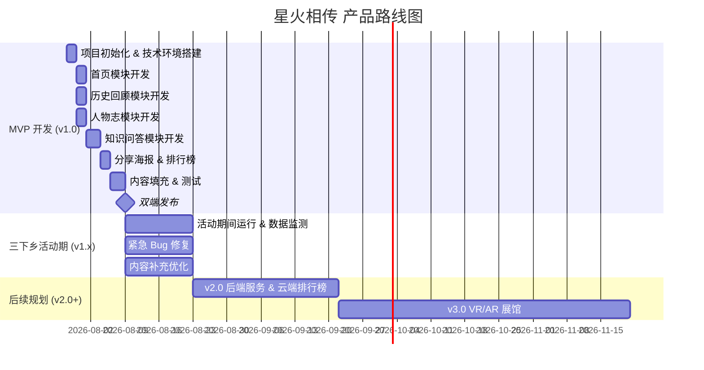

# 产品路线图 (Roadmap)

## "星火相传" —— 两弹一星精神宣传平台

---

## 目录

- [1. 路线图概述](#1-路线图概述)
- [2. 版本规划策略](#2-版本规划策略)
- [3. 详细版本规划](#3-详细版本规划)
- [4. 功能优先级矩阵](#4-功能优先级矩阵)
- [5. 详细时间线计划](#5-详细时间线计划)
- [6. 资源规划](#6-资源规划)
- [7. 风险管理](#7-风险管理)

---

## 1. 路线图概述

本项目是大学生三下乡社会实践项目，核心约束为 **2-3 周** 开发周期、**前端基础** 技术能力、**双平台**（微信小程序 + H5）交付。路线图围绕"快速交付 MVP → 活动期间迭代优化 → 长线扩展"三阶段展开。

---

## 2. 版本规划策略

| 版本 | 目标 | 核心交付 | 时间 |
|------|------|----------|------|
| **v1.0 MVP** | 三下乡活动可用 | 图文展示 + 知识问答 + 分享 | 第 1-2 周 |
| **v1.x 迭代** | 活动期间持续优化 | Bug 修复 + 内容补充 + 数据监测 | 第 3 周及活动期 |
| **v2.0 增强** | 社会实践结项后升级 | 后端服务 + 云端排行榜 + 内容管理后台 | 活动结束后 |
| **v3.0 愿景** | 长线运营 | VR/AR 展馆 + 多语言 + 社区 | 远期 |

---

## 3. 详细版本规划

### v1.0 MVP（第 1-2 周，共 14 天）

**目标**：完成可上线使用的微信小程序 + H5 网页，包含核心内容展示和互动功能。

**交付功能清单**：

| 模块 | 功能点 | 工时估算 |
|------|--------|----------|
| 项目初始化 | Taro 项目搭建、路由配置、全局样式 | 1 天 |
| 首页 | Banner 轮播、24 字精神卡片、功能入口 | 1.5 天 |
| 历史回顾 | 时间线页面、事件详情页（8+ 事件） | 1.5 天 |
| 人物志 | 人物列表、人物详情页（6+ 人物） | 1.5 天 |
| 知识问答 | 答题流程、题库（20+ 题）、结果页 | 2.5 天 |
| 排行榜 | 本地存储排行、Top 10 展示 | 1 天 |
| 分享海报 | Canvas 海报生成、保存 | 1 天 |
| 关于页 | 团队信息展示 | 0.5 天 |
| 内容填充 | 历史事件、人物资料、题库编写 | 2 天 |
| 测试修复 | 双端适配测试、Bug 修复 | 1.5 天 |
| 发布上线 | 小程序审核提交、H5 部署 | 0.5 天 |

### v1.x 迭代（第 3 周 + 活动期间）

**目标**：保障活动期间稳定运行，持续优化体验。

| 事项 | 说明 |
|------|------|
| 紧急 Bug 修复 | 响应活动现场反馈的阻断性问题 |
| 内容补充 | 根据用户反馈补充题库、修正内容错误 |
| 数据监测 | 每日查看小程序后台和 H5 统计数据 |
| 宣讲素材包 | 准备线下配套物料（小程序码展板、宣讲引导文案） |

### v2.0 增强版（活动结束后）

**目标**：从"活动工具"升级为"长期运营平台"。

| 功能 | 说明 |
|------|------|
| 微信云开发后端 | 用户登录、云端排行榜、答题数据持久化 |
| 内容管理后台 | 可视化编辑历史事件、人物、题库 |
| 视频播放 | 嵌入两弹一星纪录片/采访视频片段 |
| 更多题库 | 题库扩充至 100+ 题，支持多轮不重复 |
| 数据看板 | 可视化数据大屏，支持实践报告导出 |

### v3.0 愿景（远期）

| 功能 | 说明 |
|------|------|
| VR/AR 展馆 | 360° 全景体验核试验基地、发射场 |
| 社区互动 | 用户留言、学习心得分享 |
| 多语言 | 英文版面向国际传播 |
| 学校对接 | 与学校思政课平台对接，成为教学工具 |

---

## 4. 功能优先级矩阵 (P0/P1/P2)

| 优先级 | 定义 | 功能 |
|--------|------|------|
| **P0** | 必须要有，否则产品不可用 | 首页、历史回顾、人物志、知识问答、分享海报、双端适配 |
| **P1** | 应该有，提升体验 | 排行榜、关于页、答题倒计时、Banner 轮播 |
| **P2** | 锦上添花，资源允许再做 | 语音播报、深色模式、动画细节优化 |
| **P3** | 未来版本 | 后端服务、视频播放、VR/AR、多语言 |

---

## 5. 详细时间线计划

### 5.1 里程碑

| 里程碑 | 日期 | 交付物 | 验收标准 |
|--------|------|--------|----------|
| M1: 技术环境就绪 | D+2 | Taro 项目跑通，双端可编译 | 小程序 + H5 均可在本地运行 |
| M2: 展示模块完成 | D+5 | 首页 + 历史回顾 + 人物志 | 页面可浏览，内容完整 |
| M3: 互动模块完成 | D+9 | 知识问答 + 排行榜 + 分享 | 完整答题流程可走通 |
| M4: 内容填充完成 | D+11 | 全部内容数据就绪 | 历史事件 ≥ 8，人物 ≥ 6，题库 ≥ 20 |
| M5: 测试通过 | D+13 | 测试报告 | 核心流程无阻断性 Bug |
| M6: 上线发布 | D+14 | 小程序审核 + H5 部署 | 用户可扫码访问 |

### 5.2 每日站会检查点

- 每日 10 分钟同步进度、阻塞项、当日计划
- 使用微信群 + 腾讯文档记录

---

## 6. 资源规划

### 6.1 人力配置建议

| 角色 | 人数 | 职责 |
|------|------|------|
| 前端开发 | 2-3 人 | Taro 页面开发、双端适配 |
| 内容编辑 | 1-2 人 | 历史资料整理、题库编写、图片搜集 |
| UI 设计 | 1 人 | 页面设计、海报模板、配色方案 |
| 测试 + 项目管理 | 1 人 | 双端测试、Bug 跟踪、进度管理 |

> 团队成员可兼任，建议总人数 4-6 人。

### 6.2 工具与资源

| 类型 | 工具 | 费用 |
|------|------|------|
| 代码托管 | GitHub / Gitee | 免费 |
| 小程序注册 | 微信公众平台（个人主体） | 免费 |
| H5 托管 | GitHub Pages / 腾讯云静态托管 | 免费 |
| 设计工具 | Figma（教育版）/ Canva | 免费 |
| 项目管理 | 腾讯文档 / Notion | 免费 |
| 图片素材 | 公有领域历史图片 / 自制设计图 | 免费 |

---

## 7. 风险管理

| 风险 | 概率 | 影响 | 缓解措施 |
|------|------|------|----------|
| **小程序审核不通过** | 中 | 高 | 提前 3 天提交审核，预留修改时间；H5 兜底 |
| **内容素材不足** | 高 | 中 | 优先从公开出版物整理，注明来源；使用设计图替代实物照片 |
| **双端兼容 Bug 多** | 中 | 中 | 每个模块开发完立即双端测试，不等到最后集中测试 |
| **团队时间冲突** | 高 | 中 | 模块化拆分，降低耦合，每人独立负责一个模块 |
| **Taro 框架踩坑** | 中 | 中 | 先用 Taro 官方模板验证可行性，避免自定义配置过度 |
| **乡村网络环境差** | 中 | 低 | 图片压缩优化，控制页面总大小 < 500KB |
| **小程序个人主体限制** | 低 | 高 | 确认个人主体可发布的小程序类目，如受限则使用 H5 为主 |

---

> **文档结束** — 版本 v1.0 | 2026-07-28