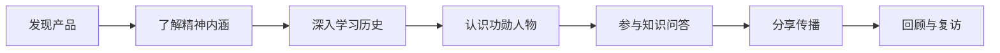

# 用户故事地图 (User Story Map)

## "星火相传" —— 两弹一星精神宣传平台

---

## 目录

- [1. 用户故事地图概述](#1-用户故事地图概述)
- [2. 用户活动流（横向）](#2-用户活动流横向)
- [3. 用户任务分解（纵向）](#3-用户任务分解纵向)
- [4. 故事优先级与版本映射](#4-故事优先级与版本映射)

---

## 1. 用户故事地图概述

本用户故事地图基于三下乡宣讲场景，围绕 **宣讲队员** 和 **普通受众** 两类核心用户，按"发现 → 了解 → 互动 → 分享 → 回顾"的用户活动流展开。

---

## 2. 用户活动流（横向）

---

## 3. 用户任务分解（纵向）

### 活动 1：发现产品

| 用户故事 | 用户类型 | 描述 | 优先级 |
|----------|----------|------|--------|
| 扫码进入小程序 | 受众 | 在宣讲现场，微信扫码直接打开小程序，无需下载 | P0 |
| 点击朋友圈链接 | 受众 | 在朋友圈看到分享链接，点击打开 H5 页面 | P0 |
| 搜索小程序名称 | 受众 | 在微信中搜索"星火相传"找到小程序 | P1 |
| 分享给好友/群 | 受众 | 将小程序/H5 链接转发给微信好友或群聊 | P0 |

### 活动 2：了解精神内涵

| 用户故事 | 用户类型 | 描述 | 优先级 |
|----------|----------|------|--------|
| 看到首页 Banner | 全体 | 打开后看到两弹一星主题图片，快速建立认知 | P0 |
| 阅读 24 字精神 | 全体 | 看到"热爱祖国、无私奉献、自力更生、艰苦奋斗、大力协同、勇于登攀" | P0 |
| 点击精神卡片看释义 | 全体 | 点击每张精神卡片，展开查看这组精神的具体含义 | P0 |
| 浏览功能入口 | 全体 | 看到"历史回顾""功勋人物""知识问答"三个入口 | P0 |

### 活动 3：深入学习历史

| 用户故事 | 用户类型 | 描述 | 优先级 |
|----------|----------|------|--------|
| 按时间线浏览历史 | 全体 | 纵向滚动时间线，从 1950 年代看到 1970 年代 | P0 |
| 查看大事件详情 | 全体 | 点击时间线节点，进入详情页阅读完整事件描述 | P0 |
| 放大查看历史图片 | 全体 | 在详情页点击图片，放大查看历史老照片 | P0 |
| 宣讲队员按时间线讲解 | 宣讲队员 | 打开时间线页面，依序向听众讲解历史进程 | P0 |
| 从大事件跳转答题 | 全体 | 在历史详情页底部看到"来答题挑战"引导 | P1 |

### 活动 4：认识功勋人物

| 用户故事 | 用户类型 | 描述 | 优先级 |
|----------|----------|------|--------|
| 浏览功勋人物列表 | 全体 | 看到钱学森、邓稼先等核心人物的卡片列表 | P0 |
| 查看人物详情 | 全体 | 点击卡片进入人物详情，阅读贡献和名言 | P0 |
| 感受人物故事共鸣 | 全体 | 阅读人物放弃国外优厚待遇、隐姓埋名等感人故事 | P0 |
| 从人物页跳转答题 | 全体 | 在人物详情页底部看到"来答题挑战"引导 | P1 |
| 查看下一位人物 | 全体 | 详情页底部引导"下一位功勋人物"，连续浏览 | P1 |

### 活动 5：参与知识问答

| 用户故事 | 用户类型 | 描述 | 优先级 |
|----------|----------|------|--------|
| 开始答题挑战 | 全体 | 点击"开始答题"，随机抽取 5 道题 | P0 |
| 选择答案看对错 | 全体 | 点击选项，看到绿色正确/红色错误反馈 | P0 |
| 倒计时答题 | 全体 | 每题 30 秒倒计时，增加紧张感和趣味性 | P1 |
| 查看答题结果 | 全体 | 答完 5 题后看到得分和评语 | P0 |
| 获得高分称号 | 全体 | 5/5 答对获得"两弹一星精神传承人"称号 | P0 |
| 再来一轮 | 全体 | 点击"再来一轮"，重新随机抽 5 题 | P0 |
| 查看排行榜 | 全体 | 看到自己的最高分和 Top 10 排名 | P1 |
| 宣讲队员组织答题比赛 | 宣讲队员 | 在宣讲现场引导听众扫码答题，营造比赛氛围 | P0 |

### 活动 6：分享传播

| 用户故事 | 用户类型 | 描述 | 优先级 |
|----------|----------|------|--------|
| 生成分享海报 | 全体 | 答题后点击"分享成绩"，生成带分数的海报 | P0 |
| 保存海报到相册 | 全体 | 小程序端保存海报图片到手机相册 | P0 |
| 分享到朋友圈 | 全体 | 将海报或链接分享到微信朋友圈 | P0 |
| H5 端长按保存 | 全体 | 在 H5 网页端长按海报图片保存 | P0 |
| 邀请好友答题 | 全体 | 分享时附带"你也来挑战"的引导文案 | P1 |

### 活动 7：回顾与复访

| 用户故事 | 用户类型 | 描述 | 优先级 |
|----------|----------|------|--------|
| 查看团队信息 | 全体 | 在"关于"页了解三下乡团队和项目背景 | P1 |
| 再次答题刷分 | 全体 | 隔天再次打开小程序答题，挑战更高分 | P1 |
| 查看参考来源 | 全体 | 在关于页查看内容参考来源，深入学习 | P2 |
| 给团队反馈 | 全体 | 通过联系方式给团队提建议 | P2 |

---

## 4. 故事优先级与版本映射

### v1.0 MVP 范围（P0 故事）

| 活动 | P0 故事数量 | 说明 |
|------|-----------|------|
| 发现产品 | 3 | 扫码、点击链接、分享 |
| 了解精神内涵 | 4 | Banner、24 字、精神卡片、功能入口 |
| 深入学习历史 | 4 | 时间线、详情页、图片放大、宣讲辅助 |
| 认识功勋人物 | 3 | 人物列表、详情页、故事共鸣 |
| 参与知识问答 | 5 | 开始答题、选答案、看结果、称号、再来一轮 |
| 分享传播 | 4 | 生成海报、保存、朋友圈、H5 保存 |
| **合计** | **23** | |

### v1.x 迭代范围（P1 故事）

| 活动 | P1 故事 | 说明 |
|------|---------|------|
| 发现产品 | 搜索小程序 | 微信搜索优化 |
| 深入学习历史 | 跳转答题引导 | 详情页底部增加答题入口 |
| 认识功勋人物 | 跳转答题 + 下一位引导 | 详情页底部增强 |
| 参与知识问答 | 倒计时 + 排行榜 | 答题体验优化 |
| 分享传播 | 邀请文案 | 分享时附带引导文案 |
| 回顾与复访 | 团队信息 + 再次答题 | 关于页完善 |

### v2.0+ 范围（P2 故事）

| 活动 | 故事 | 说明 |
|------|------|------|
| 回顾与复访 | 参考来源、反馈渠道 | 内容透明化 |
| 全部活动 | 语音播报、深色模式、离线浏览 | 无障碍与体验优化 |

---

> **文档结束** — 版本 v1.0 | 2026-07-28